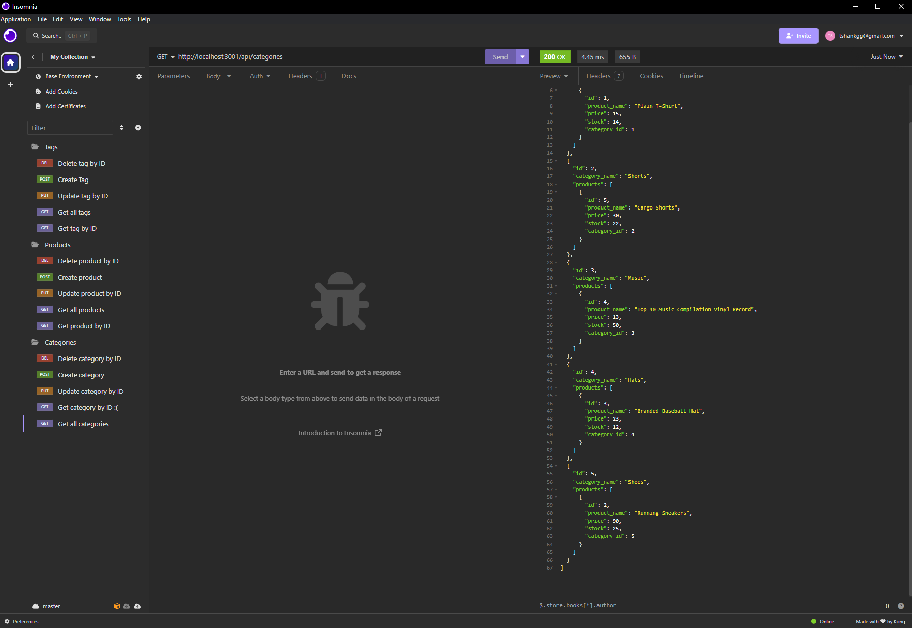

# ORM E-Commerce Backend

  
  ## Table of Contents

  - [Description](#description)
  - [Installation](#installation)
  - [Usage](#usage)
  - [Contributions](#contributions)
  - [Tests](#tests)
  - [License](#license)
  - [Questions](#questions)
  
  ## Description

  In this project we used Sequelize to interact with a Mysql database and perform CRUD requests

  ## Installation
  
  You will need to run an "npm i", as well as "npm run seed" and "npm start". You can then utilize CRUD functions in Insomnia

  ## Usage

  Here is a video walkthrough on how to use this project: https://drive.google.com/file/d/12hyWGyb72FQfT6kAnH4z4EuedusFoUsO/view

  ## Contributions
  
  N/A

  ## Tests
  
  N/A
  

  ## License
  
  MIT
  

  ## Questions
  
  Have questions about this project? Contact me!
  Email me at: tshankgg@gmail.com,
  or find me on GitHub here: https://github.com/FirefoxFlareon

